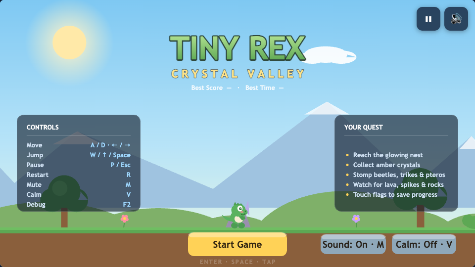

# Tiny Rex: Crystal Valley

A cheerful, fully original 2D side-scrolling platformer for the browser. Rex, a cute
baby T-rex, scrambles across a prehistoric valley full of amber crystals, beetles,
trike pups, pterosaurs, lava, and falling rocks to reach the glowing nest at the end.

Everything — sprites, scenery, particles, and sound — is generated procedurally with
Canvas 2D drawing and the Web Audio API. There are **no external assets or runtime
libraries**; the only tooling is Vite + TypeScript for the dev server, typecheck,
tests, and a single-file production build.



*Main menu — title lockup, level cards, difficulty pills, lifetime stats, controls and quest panels.*

## How to run

**Dev server:**

```sh
npm install
npm run dev
# then open the printed URL (http://localhost:5173)
```

**Production build:**

```sh
npm run build
# dist/index.html is fully self-contained (JS + CSS inlined) — open it directly
# or host it on any static server.
```

Useful scripts: `npm test` (Vitest), `npm run typecheck`, `npm run lint`,
`npm run preview` (serve the production build locally).

## Playability evidence

The full state machine was verified in a real (headless) browser: screenshots
of every key screen (menu, running, dying, game over, checkpoint respawn,
pause, victory) plus a recorded playthrough video live in
[`docs/evidence/`](docs/evidence/), with per-frame state logs and
reproduction steps in [`docs/PLAYABILITY.md`](docs/PLAYABILITY.md).

Re-capture with:

```sh
npm run dev &                        # or any server URL as the second arg
node scripts/capture-evidence.mjs
```

## Controls

| Action            | Keyboard                          | Touch          |
| ----------------- | --------------------------------- | -------------- |
| Move left/right   | `A`/`D` or `←`/`→`                | ◀ / ▶ buttons  |
| Jump              | `W`, `↑`, or `Space`              | ▲ button       |
| Pause / resume    | `P` or `Esc`                      | pause button*  |
| Restart level     | `R`                               | —              |
| Choose level (menu) | `←` / `→`                       | tap a level card |
| Choose difficulty (menu) | `↑` / `↓`                 | tap a pill     |
| Mute sound        | `M`                               | 🔊 button      |
| Reduced motion    | `V`                               | “Calm” button* |
| Debug overlay     | `F2`                              | —              |
| Confirm / start   | `Enter` or `Space`                | tap            |
| Gamepad           | D-pad/stick move, **A**/**X** jump, **B**/**Start** confirm | — |

\* On the start menu the **Sound** and **Calm** buttons do the same as `M`/`V`; while
paused, the on-screen **Resume/Restart/Menu** buttons work by tap. Touch buttons
appear automatically on coarse-pointer devices or the first touch, and multi-touch
(move + jump simultaneously) is supported.

Hold jump for a full-height jump; release early for a short hop. Jumping has coyote
time and input buffering, so well-timed jumps land forgivingly.

## Feature summary

- **Feel-tuned platforming** — acceleration/friction movement, gravity, coyote time,
  jump buffering, variable jump height, squash & stretch, landing dust, screen shake.
- **Two hand-designed levels** (~7,500 px each, 3–6 min). *Crystal Valley* — a safe
  teaching opening, gradually introduced enemies/hazards, a moving-platform lava
  river, a rockfall stretch, a hidden elevated bonus crystal, and a glowing goal
  nest. *Volcanic Depths* — a night-lit volcanic theme (stars, drifting embers) with
  a lava-moat stone-hop, twin falling-rock gauntlets, and an ember nest. Pick a level
  from the menu cards; your choice persists.
- **Three original enemies** — a wall/ledge-patrolling beetle, a hopping baby
  triceratops, and a sine-wave flying pterosaur. Stomp them from above for points.
- **Hazards** — lava pools (damage + bounce), spike pits, timed falling rocks with a
  telegraph, and bottomless pits.
- **Health that scales with difficulty** (5 / 3 / 2 hearts) with invulnerability
  flashing, knockback, a death tumble, and respawn at the latest of **3 checkpoints**
  (nearby enemies reset on respawn so you can never be spawned into a kill).
- **Amber crystals** — 39 in Crystal Valley and 30 in Volcanic Depths (one 500-pt
  bonus crystal each on a risk/reward route), animated pickups with sparkles and
  floating score text.
- **Three difficulties** — Easy (5 hearts, slower enemies), Normal (3 hearts),
  Hard (2 hearts, faster enemies); the choice persists across sessions.
- **Star ratings** — each run earns 1–3 stars: finish the level, keep ≥2 hearts,
  collect ≥80% of its crystals. Best stars per level are saved and shown on the menu
  cards and the victory screen ("NEW BEST STARS!" when you improve).
- **Lifetime stats** — plays, deaths, crystals collected, and first-play date,
  shown on the main menu and stored in `localStorage`.
- **Score & records** — crystals, stomps, checkpoints, remaining hearts, and a
  completion-time bonus; best score and fastest time persist per level.
- **Full state flow** — animated menu → play → pause → checkpoint/damage/death →
  respawn → game over → try again → victory results → play again/menu.
- **Procedural audio** — Web Audio synth SFX for jump, collect, bonus, stomp, hurt,
  death, checkpoint, crumble, rocks, victory, and UI, plus a subtle ambient wind
  layer with occasional bird chirps. Each level also has its own **chiptune music
  loop** (lead + bass, scheduled ahead of time) that plays during a run and pauses
  with the game. Audio starts only after the first user gesture; mute toggle
  (`M` / 🔊).
- **Gamepad support** — auto-detected and polled each frame: D-pad or left stick to
  move (and navigate the menu), **A**/**X** to jump, **B**/**Start** to confirm.
- **Mobile haptics** — where the device supports `navigator.vibrate`, a short pulse
  on stomps and a double pattern on taking damage.
- **Accessibility & polish** — reduced-motion mode (no screen shake, fewer
  particles), high-contrast HUD text, ≥44 px touch targets, concise status messages,
  auto-pause when the tab is hidden, and an `F2` debug overlay (FPS, position,
  velocity, grounded state, collision boxes).
- **Responsive canvas** — fixed 960×540 logical resolution, DPR-aware (capped at 2×),
  letterboxed to fit any window; collision coordinates always use logical pixels.

## File structure

```
index.html   Page shell: canvas, mute button, touch-control buttons. No logic.
styles.css   Letterboxed full-screen layout, touch-button styling & visibility.
src/
  main.ts        Entry point: builds the Game, wires touch controls, starts the loop.
  config.ts      CFG — all tunable gameplay constants (below).
  ctx.ts         GameCtx — the service surface entities receive instead of the Game.
  store.ts       Safe localStorage wrapper (settings + best records).
  audio.ts       AudioManager — Web Audio SFX synth + ambient loop, mute, unlock.
  input.ts       Keyboard, jump buffer stamping, touch buttons.
  particles.ts   Particle / FloatingText — dust, sparkles, chunks, score popups.
  platform.ts    Ground / wood / stone / mover / crumble solids.
  crystal.ts     Bobbing, spinning amber crystals.
  enemy.ts       Beetle / trike / ptero AI (patrol, hop, wave).
  hazard.ts      Lava, spikes, telegraphed falling rocks.
  checkpoint.ts  Checkpoint flag activation.
  goal.ts        The goal nest.
  player.ts      Physics, collision, damage/stomp/checkpoint logic.
  camera.ts      Smooth follow with look-ahead, clamps, shake.
  level.ts       Owns level data, updates the world, respawn resets.
  background.ts  Parallax sky, mountains, volcanoes, clouds.
  decor.ts       Trees, bushes, rocks, flowers, tufts, sign.
  sprite.ts      Procedural drawing of Rex + all enemies.
  game.ts        State machine, fixed-timestep loop, HUD, menus.
  touch-controls.ts  DOM touch-button bindings.
  level-data.ts  LEVELS — the two hand-designed levels (Crystal Valley, Volcanic Depths).
  util.ts        Small shared helpers (clamp, lerp, overlap, rng, fmtTime).
tests/         Vitest suite: physics, state machine, level-data integrity.
README.md      This file.
```

## Important tuning constants

All gameplay numbers live in the `CFG` object in `src/config.ts`, so balance
changes are one-line edits:

- `CFG.fixedDt` (1/60) — fixed physics timestep; the render loop accumulates real
  frame time and steps in increments of this so physics is framerate-independent.
- `CFG.player` — the movement feel:
  - `accel` / `airAccel` — ground vs. air acceleration (px/s²).
  - `friction` / `airDrag` — deceleration when no key is held; keep ground friction
    high for responsive, non-slippery controls.
  - `maxSpeed` — horizontal speed cap (285 px/s ≈ 1.9 tiles/s).
  - `gravity` (1500) and `maxFall` (940) — fall curve; `maxFall` is deliberately
    below the tunneling limit (thinnest solid 24 px ÷ fixedDt).
  - `jumpVel` (625) — launch speed (~130 px, ≈ 3 player heights).
  - `coyoteTime` (0.1 s) — grace period to still jump after walking off a ledge.
  - `jumpBuffer` (0.13 s) — a jump pressed just before landing still fires.
  - `jumpCut` (0.42) — releasing jump multiplies upward velocity by this **once**
    (edge-triggered) for short hops.
  - `stompBounce` / `stompBounceHeld` — bounce after stomping (hold jump for a higher
    bounce).
  - `knockX` / `knockY` / `invulnTime` — damage knockback and i-frames.
  - `lavaBounce` — upward flick when touching lava.
  - `respawnInvuln` — brief i-frames after respawning at a checkpoint.
- `CFG.score` — point values: `crystal` 100, `bonusCrystal` 500, `stomp` 200,
  `checkpoint` 250, `heartBonus` 400/heart, and `timeBonusBase` 2400 minus
  `timeBonusPerSec` 10 per second (floors at 0).
- `CFG.camera` — `lerp` (follow smoothness), `lookAhead` (pixels of forward peek),
  `maxShake` (screen-shake ceiling, 0 in reduced-motion mode).
- `CFG.killY` (680) — the y below which the player is considered lost in a pit.

Level layout lives in `LEVELS` in `src/level-data.ts`: each level's platforms,
crystals, hazards, checkpoints, enemies, and decoration are plain arrays, so new
sections can be added by appending entries (ground tops sit at y = 460; each level
is 7,550 px wide). `LEVEL_DATA` remains exported as an alias for level 1.

## License

MIT — see [LICENSE](LICENSE). All art, music, and code are original and
generated procedurally at runtime.
